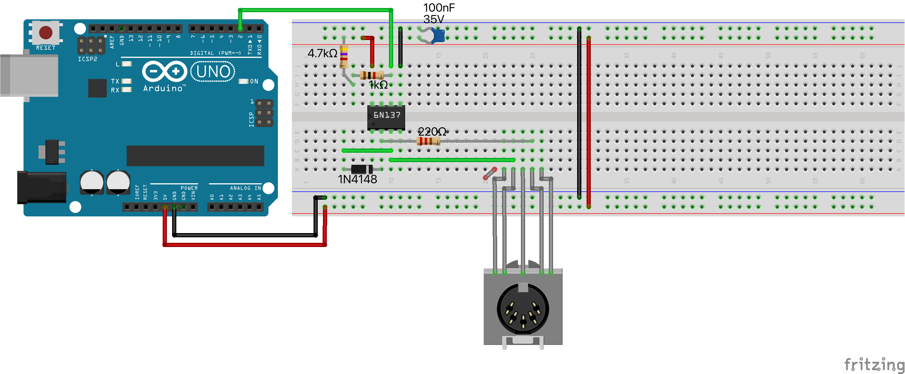
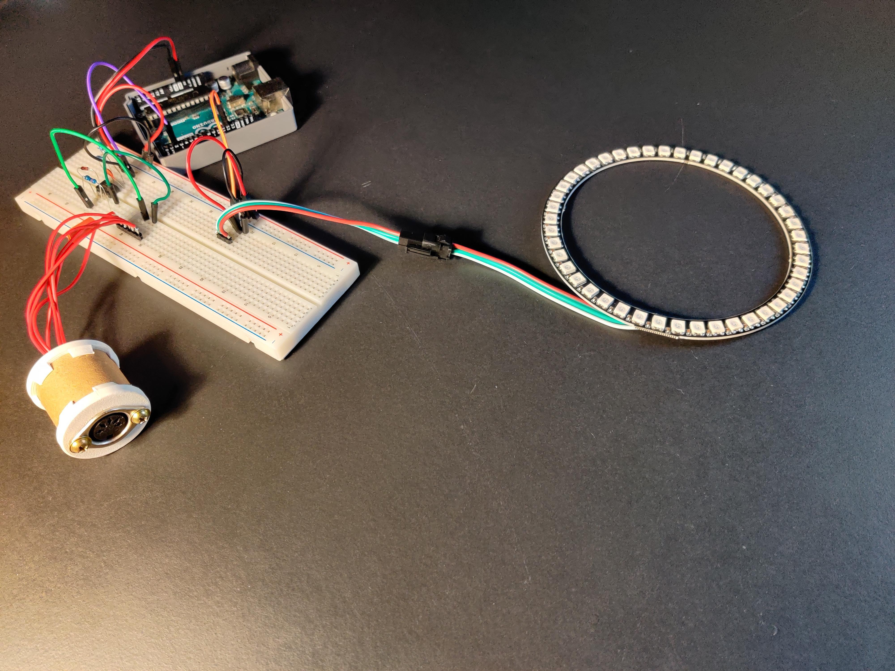

# Arduino Uno Midi Input

This is a report on using MIDI input with Arduino Uno. As I had MIDI female ports laying around for my synth I want to build I tested them out and wanted to know what capabilities & possibilities from Arduino in combination with MIDI emerge.

So you can use this as:
- small tutorial
- example code
- Do's and Don'ts

Please be aware that I just searched around the web and there may be issues with the hardware setup, but this worked for me, so for you it works probably too.

### Bill of material (BOM)
- **Arduino Uno**
- Breadboard, Jumper, USB Cable etc. (experimenting equipment)
- **5-Pin Midi Port Female**
- **6N137 high speed photocoupler** (10 pcs are 3 euros at aliexpress)
    - you can use **also 6N138 or 74HC14**, but then you need another circuit
    - cheap 4N35, C1010 do not really work because they are too slow for MIDI
    - you cannot ignore the photocoupler, because it ensures isolating the different ground levels of MIDI sender and MIDI receiver to keep the mains hum out

- **220 Ohm** resistor
- **5.7 kOhm** resistor (or 1 kOhm & 4.7 kOhm resistors)
- **1N4148 diode** (high speed)

And obviously, if you want to try it out, you need:
- MIDI cable
- MIDI-enabled device like a drum sequencer (I use a Beatstep Pro) or keyboard

### Sources

- Errors on MIDI input using 6N137 (most info)
  https://forum.arduino.cc/t/midi-input-using-a-6n137-flood-of-midi-messages-and-wrong-values/395143
- Midi status commands table
  https://www.midi.org/specifications-old/item/table-2-expanded-messages-list-status-bytes
- Midi protocol tutorial
  https://www.amazona.de/workshop-das-midi-datenformat-einfach-erklaert/


### Hardware setup




For more images look at the image folder.

As you see, I 3D-printed a small case for the socket using old screws and a cardboard pipe.


### Do's and don'ts when using MIDI
- Do not use delays when receiving MIDI messages (that makes them corrupt or you ignore messages during the delay)
- Probably keep the circuit small and tight to avoid unwanted interferences with high speed MIDI messages
- If you want to use an alternative opto coupler, read the datasheet and decide if your opto coupler switches faster than 4us or something like that
- **It doesn't support multiple notes on currently!** Send only one note on per time!


## Software

### Code setup
- install the standard arduino midi library from the integrated IDE menu
  (https://www.arduino.cc/reference/en/libraries/midi-library/)

### Arduino Code Example 1 (Midi -> Serial)
```c++
#include <SoftwareSerial.h>
#include <MIDI.h>

SoftwareSerial midiSerial(2, 3);  // RX, TX
MIDI_CREATE_INSTANCE(SoftwareSerial, midiSerial, MIDI);


void setup() {
  MIDI.begin(MIDI_CHANNEL_OMNI);
  Serial.begin(115200);
  Serial.println("INIT");
}

void loop() {
  if (MIDI.read()) {
    byte type = MIDI.getType();
    byte channel = MIDI.getChannel();
    byte number = MIDI.getData1();

    // type == 250: start
    // type == 252: stop
    if (type != 160 && type != 248) { // ignore aftertouch & timing
      Serial.print(type);
      Serial.print("\t");
      Serial.print(channel);
      Serial.print("\t");
      Serial.println(number);
      delay(1);
    }
  }
}

```
### Arduino Code Example 2 (Midi -> Neopixel Effect)

```c++
#include <SoftwareSerial.h>
#include <MIDI.h>
#include <Adafruit_NeoPixel.h>
#include <RGBConverter.h>


#define NUMPIXELS 45

SoftwareSerial midiSerial(2, 3);  // RX, TX
MIDI_CREATE_INSTANCE(SoftwareSerial, midiSerial, MIDI);

Adafruit_NeoPixel pixels(NUMPIXELS, 12, NEO_GRB + NEO_KHZ800);
RGBConverter rgbconv;

float hue;
byte rgb[] = { 0, 0, 0 };

int offset1 = 0;
int offset2 = 0;

void setup() {
  pixels.begin();
  pixels.clear();

  pixels.fill(pixels.Color(20, 20, 20));
  pixels.show();
  delay(10);
  
  pixels.fill(pixels.Color(0, 0, 0));
  pixels.show();
  MIDI.begin(MIDI_CHANNEL_OMNI);
}

void loop() {
  if (MIDI.read()) {
    byte type = MIDI.getType();
    byte channel = MIDI.getChannel();
    byte number = MIDI.getData1();

    // type == 250: start
    // type == 252: stop
    if (channel == 10) {
      if (type == 144) {
        if (number == 36) {
          hue = ((float)random(0, 100)) / 100.0;
          rgbconv.hsvToRgb(hue, 1, 0.01, rgb);
          pixels.fill(pixels.Color(rgb[0], rgb[1], rgb[2]));
          pixels.show();
        } else if (number == 37) {
          hue = ((float)random(0, 100)) / 100.0;
          rgbconv.hsvToRgb(hue, 1, 0.01, rgb);
          offset1 += 1;
          offset1 %= 5;
          for (int i = offset1; i < 45+offset1; i+= 5) {
            pixels.setPixelColor(i, pixels.Color(rgb[0], rgb[1], rgb[2]));
          } 
          pixels.show();
        } else if (number == 38) {
          hue = ((float)random(0, 100)) / 100.0;
          rgbconv.hsvToRgb(hue, 1, 0.01, rgb);
          offset2 += 1;
          offset2 %= 9;
          for (int i = offset2; i < 45+offset2; i+= 9) {
            pixels.setPixelColor(i, pixels.Color(rgb[0], rgb[1], rgb[2]));
          } 
          pixels.show();
        }
      } else if (type == 128) {
        pixels.fill(pixels.Color(0, 0, 0));
        pixels.show();
      }
    }
  }
}
```